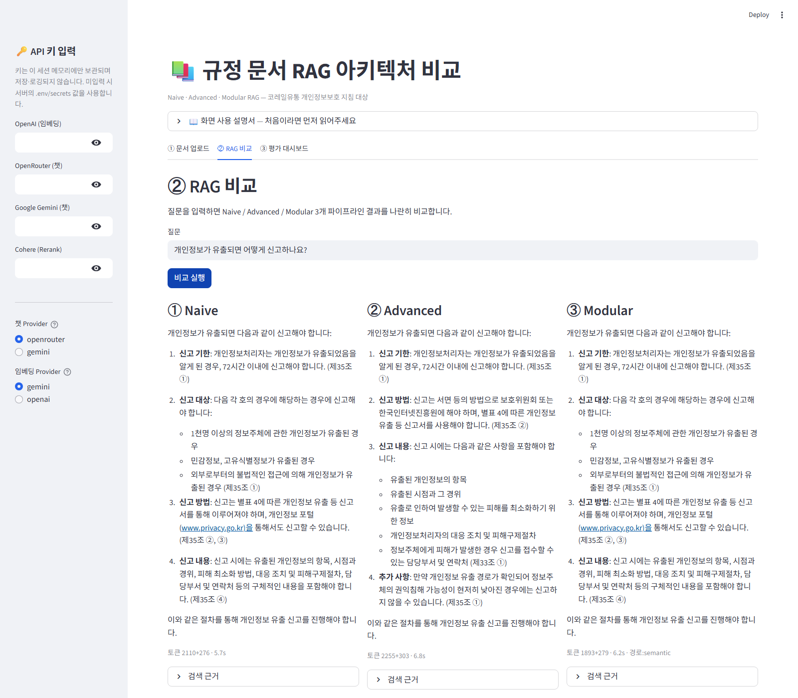
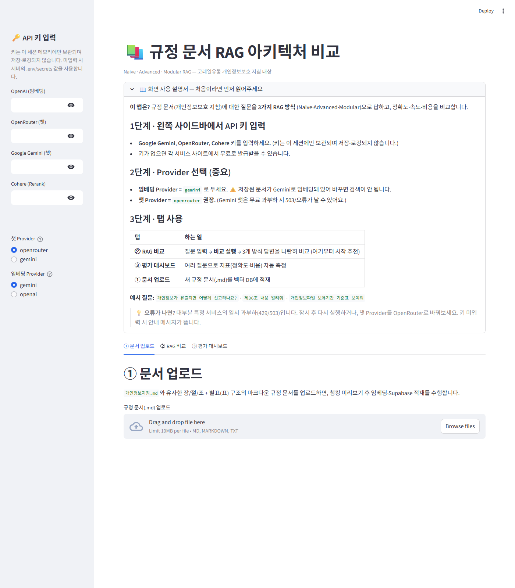

# 📚 규정 문서 RAG 아키텍처 비교 (Naive · Advanced · Modular)

동일한 한국어 규정 문서를 대상으로 **3가지 RAG(Retrieval-Augmented Generation)
아키텍처를 모두 구축**하고 정확도·속도·비용을 **정량 비교**하는 오픈소스 프로젝트입니다.
사내 "AI 챔피언 고급과정" 실습 산출물이며, 대상 문서는 장/절/조 계층 + 별표(표)가
혼재된 개인정보보호 지침입니다.

## 📑 최종 레포트 (제출본)

### 👉 **[최종 레포트 전체 보기 — docs/FINAL_REPORT.md](docs/FINAL_REPORT.md)**

[](docs/FINAL_REPORT.md)

> 배경·목표·설계·구현·실험·결과·인사이트·향후계획을 통합한 제출용 레포트입니다.
> (성능 비교 상세는 [벤치마크 보고서](docs/benchmark_report.md) 참고)

---

## 🔗 라이브 데모 (바로 체험)

### 👉 **https://aichampion-rag.streamlit.app/**

[](https://aichampion-rag.streamlit.app/)

> 접속 후 왼쪽 사이드바에 **본인의 API 키**(Gemini·OpenRouter·Cohere)를 입력하면 바로
> 사용할 수 있습니다. **임베딩 Provider는 `gemini`**, **챗 Provider는 `openrouter`** 권장.
> (앱 소유자 키 비용 도용 방지를 위해 방문자가 자기 키를 입력하는 방식입니다.)

### 🖼️ 데모 화면

**② RAG 비교 탭** — 같은 질문에 대해 Naive·Advanced·Modular 3개 방식이 각각 답변하고
근거 조문·토큰·시간을 함께 보여줍니다.



<details>
<summary>🏠 홈 화면 · 사용 설명서 펼쳐보기</summary>



</details>

---


[](https://aichampion-rag.streamlit.app/)

## ✨ 주요 기능

- **3개 RAG 파이프라인**을 동일 조건(임베딩·청크·컨텍스트 예산·프롬프트 고정)으로 비교
- **구조 기반 청킹**: 장/절/조 계층 인식, 조=청크, 표(별표)는 자연어 캡션으로 이중 인덱싱
- **평가 프레임워크**: Recall@k · MRR · nDCG · faithfulness · 지연 · 비용 + 오류 3단 분류(E1/E2/E3)
- **Streamlit 3탭 앱**: ① 문서 업로드 ② RAG 비교 ③ 평가 대시보드
- **Provider 추상화**: 챗(OpenRouter/Gemini)·임베딩(Gemini/OpenAI)·rerank(Cohere)를
  교체 가능 → 폐쇄망(온프레미스) 전환 대비

## 🏗️ 3가지 아키텍처

| 단계 | ① Naive | ② Advanced | ③ Modular |
| --- | --- | --- | --- |
| 쿼리 전처리 | 없음 | 쿼리 재작성(LLM) | 라우팅(조번호/표/의미) |
| 검색 | 벡터 top-5 | 벡터 top-20 | 하이브리드(BM25+벡터, RRF) |
| 재정렬 | 없음 | Cohere Rerank | Cohere Rerank |
| 추가 | — | 검색 후 필터 | 조건부 인접 청크 확장 |

---

## 🔬 동작 원리 상세 (전체 흐름 · 청킹 · 파이프라인별 단계)

### 1. 전체 흐름 한눈에 보기

이 프로그램은 **두 개의 흐름**으로 나뉩니다: 문서를 저장소에 넣는 **① 적재(indexing)**,
질문에 답하는 **② 질의(query)**. 적재는 문서를 바꿀 때만, 질의는 질문할 때마다 실행됩니다.

```
① 적재 (문서를 넣을 때 1회)
   개인정보지침.md
        │  (1) 구조 기반 청킹 — chunker.py (정규식으로 장/절/조/별표 인식)
        ▼
   94개 청크 (각 청크: content 원문 + embed_text 검색용텍스트 + 메타데이터)
        │  (2) 임베딩 — Gemini gemini-embedding-001 (task_type=RETRIEVAL_DOCUMENT)
        ▼
   1536차원 벡터
        │  (3) 저장 — Supabase rag_chunks (pgvector, HNSW·BM25 인덱스)
        ▼
   [벡터 DB 준비 완료]

② 질의 (질문할 때마다)
   "개인정보가 유출되면 어떻게 신고하나요?"
        │  (1) 질문 임베딩 — Gemini (task_type=RETRIEVAL_QUERY)
        ▼
   질문 벡터  ──(2) 검색──▶  Supabase에서 관련 청크 회수
        │                     (파이프라인마다 검색 방식이 다름 — 아래 3장)
        │  (3) [Advanced/Modular] Cohere Rerank로 정밀 재정렬
        │  (4) 최종 5개 청크를 문맥으로 조립 (prompts.py 공유 템플릿)
        ▼
   LLM 생성 — OpenRouter(gpt-4o-mini) 또는 Gemini
        ▼
   답변 + 근거 조문 (예: "72시간 이내 신고… — 제35조")
```

> 핵심: **질의 임베딩과 문서 임베딩은 반드시 같은 모델**이어야 벡터 공간이 맞습니다.
> 그래서 적재를 Gemini로 했으면 질의도 Gemini여야 합니다(앱 사이드바 기본값 gemini).

### 2. 청킹 방법과 규칙 (chunker.py)

**왜 구조 기반인가?** 규정의 의미 단위는 "조(條)"입니다. 500자씩 기계적으로 자르면 조문이
반토막 나 답변이 불완전해집니다. 또 이 문서는 **마크다운 헤딩 표기가 들쭉날쭉**(일부 조문만
`###`)이라, 헤딩 기호가 아니라 **정규식 텍스트 패턴**으로 경계를 인식합니다.

**경계 인식 패턴** (헤딩 기호 불신):

| 구조 | 패턴 | 예 |
| --- | --- | --- |
| 장 | `제N장 <제목>` | 제2장 개인정보 처리기준 |
| 절 | `제N절 <제목>` | 제1절 개인정보의 처리 |
| 조 | `제N조(<제목>)` / `제N조의N(...)` | 제35조(개인정보 유출 등의 신고) |
| 항/호/목 | `①②…` / `1. 2.` / `가. 나.` | 조 분할 시 사용 |
| 별표 | `[별표 N]` | `[별표 1](제47조 관련)` |

**청크 생성 규칙 R1~R9:**

| 규칙 | 내용 | 이유 |
| --- | --- | --- |
| **R1** | **1조 = 1청크** | 조가 규정의 의미 단위 |
| **R2** | 800토큰 초과 조문은 **항(①)/호(1.) 단위 분할** + 각 조각 앞에 조 헤더 반복 | 임베딩 품질은 200~800토큰에서 안정. 헤더 반복으로 분할 후에도 맥락 유지 |
| **R3** | **1별표 = 1청크** (표 분할 금지) | 표의 행은 헤더 없이 해석 불가 |
| **R4** | 삭제 조문도 청크로 포함 (`content_type='deleted'`) | "제16조?"에 "삭제됨"이라 답하는 게 침묵보다 나음 |
| **R5** | 제·개정 연혁을 1청크(`preamble`) | "언제 개정됐어?" 대응 |
| **R6** | 장/절 헤더는 청크로 안 만들고 **메타데이터로만** 보유 | 헤더 단독 청크는 검색 노이즈 |
| **R7** | `content`(답변용 원문)와 `embed_text`(검색용: 브레드크럼+본문) **분리 저장** | "보여줄 텍스트"와 "검색에 유리한 텍스트"는 다름 |
| **R8** | `<br>`→개행, `ㆍ` 등 특수문자·연속공백 정규화 | 실사에서 확인된 노이즈 제거 |
| **R9** | **표 이중 인덱싱** — 표 청크는 규칙 기반 **자연어 캡션**으로 임베딩, 답변엔 원본 표 제시 | 마크다운 표 기호(`\|`,`---`)는 임베딩 노이즈. 캡션 예: "별표 1(보유기간 책정 기준표), 제47조 관련 서식, 항목: 보유기간, 대상 파일" |

**브레드크럼(R7 예시):** 짧은 조문의 맥락을 보강하려고 임베딩 텍스트 앞에 경로를 붙입니다 —
`[제2장 개인정보 처리기준 > 제6절 정보주체의 권리보장 > 제36조(권리보장의 방법 및 절차)]`

**실측 결과:** 개인정보지침.md → **94청크** (조문 71 / 별표 14 / 삭제 8 / 연혁 1).
"제4장"이 문서에 두 번 나오는데, 장 번호 대신 **등장 순번(`chapter_seq`)**을 유니크 키로 써서 구분합니다.

**메타데이터 스키마(요약):** `article_no`(조번호, 평가 골드 라벨) · `content_type`(article/table/deleted/preamble,
라우팅 필터) · `chapter_seq/chapter_no/section_no` · `annex_no`(별표) · `related_articles`(별표↔조 참조) ·
`chunk_index`(인접 확장용 순번) · `embed_text`/`content` 분리. 전체는 [`sql/schema.sql`](sql/schema.sql).

### 3. 각 RAG별 구성과 단계별 흐름

세 파이프라인은 **동일한 청크·임베딩·챗 모델·최종 5청크 예산·답변 프롬프트**를 공유합니다(공정 비교).
차이는 오직 "검색을 어떻게 하느냐"입니다.

#### ① Naive RAG — 가장 단순 ([naive_rag.py](naive_rag.py))
```
질문 ──▶ [1] 질문 임베딩(Gemini)
     ──▶ [2] 벡터 유사도 검색 top-5 (store.match)
     ──▶ [3] 문맥 조립 (prompts.build_answer_prompt)
     ──▶ [4] LLM 생성 (chat.complete, temperature=0)
     ──▶ 답변 + 근거
```
- **구성:** 임베더 + 벡터스토어 + 챗. (재작성·재정렬·라우팅 없음)
- **LLM 호출:** 1회(생성). **rerank:** 없음.
- **강점:** 가장 빠르고 저렴, 쉬운 질의에 충분. **약점:** 모호/구어체 질의에 취약.

#### ② Advanced RAG — 검색 전/후 최적화 ([advanced_rag.py](advanced_rag.py))
```
질문 ──▶ [1] 쿼리 재작성 (QueryRewriter, LLM 1회)
             "직원 실수로 새어나가면?" → "개인정보 유출 시 대응 조치 및 의무"
     ──▶ [2] 재작성 질의 임베딩(Gemini)
     ──▶ [3] 벡터 검색 top-20 (넓게 회수)
     ──▶ [4] Cohere Rerank (원 질문 기준) → 관련도 점수순 재정렬
     ──▶ [5] 점수 임계치 필터 → 상위 5개 (검색 후 압축)
     ──▶ [6] 문맥 조립 → LLM 생성
     ──▶ 답변 + 근거
```
- **구성:** Naive + **쿼리 재작성기** + **Cohere Reranker**.
- **LLM 호출:** 2회(재작성 + 생성). **rerank:** 항상 1회.
- **설계 포인트:** 검색은 *재작성 질의*로(재현율↑), rerank는 *원 질문*으로(의도 보존).
- **강점:** 구어체·모호 질의, 약한 임베딩 보완. **약점:** 비용↑, 명확한 질의는 오히려 순위 흐트러뜨릴 수 있음.

#### ③ Modular RAG — 라우팅 + 하이브리드 + 인접확장 ([modular_rag.py](modular_rag.py))
```
질문 ──▶ [1] 라우팅 (QueryRouter, 2단)
             1차 규칙: "제N조/별표N" 있으면 → DIRECT
                       "서식/대장/별표" 키워드 → TABLE
             2차 LLM(1차 미분류 시): TABLE vs SEMANTIC
     ──▶ [2] 경로별 검색
             ├ DIRECT   : 조번호로 DB 직접 조회 (get_by_article) — rerank 없음, 토큰 최소
             ├ TABLE    : content_type='table' 필터 벡터검색 → Cohere Rerank
             └ SEMANTIC : 하이브리드(BM25+벡터, RRF 융합) → Cohere Rerank
     ──▶ [3] 상위 5개로 압축
     ──▶ [4] 조건부 인접 청크 확장
             최상위 청크가 분할청크이거나 "전조/다음 각 호" 참조표현 포함 시에만
             chunk_index ±1 이웃을 직접 조회해 문맥 보강 (5청크 예산 유지)
     ──▶ [5] 문맥 조립 → LLM 생성
     ──▶ 답변 + 근거
```
- **구성:** Naive + **라우터** + **하이브리드 검색** + **Cohere Reranker** + **인접확장**.
- **LLM 호출:** 2~4회(라우팅 + 생성, 필요 시 추가). **rerank:** DIRECT 경로는 생략, 그 외 1회.
- **강점:** "제N조" 질의를 직접조회로 정확·저비용(토큰 1/3), 표 질의·다문서에 강함.
  **약점:** 가장 복잡, 라우팅 오분류 위험.

> **세 파이프라인 공통 반환:** 모두 `RagAnswer`(답변·근거 청크·토큰·지연·trace)를 돌려주므로
> 평가·비교가 동일하게 처리됩니다. 조립은 [`pipeline_factory.py`](pipeline_factory.py)에서 공유합니다.

---

## 🧰 기술 스택

- 벡터 저장소: **Supabase (pgvector)** — HNSW 인덱스, RRF 하이브리드 검색 RPC
- 임베딩: **Gemini `gemini-embedding-001`** (1536차원, 문서/질의 비대칭 task_type)
  — `OpenAIEmbeddingProvider`도 선택 가능
- 챗: **OpenRouter** + **Google Gemini** 이중 지원(공통 `ChatProvider` 인터페이스)
- 재정렬: **Cohere Rerank** (다국어)
- 앱/배포: **Streamlit** + **Streamlit Community Cloud**

## 🚀 빠른 시작

> 설치 없이 바로 써보려면 **[라이브 데모](https://aichampion-rag.streamlit.app/)** 를 이용하세요.
> 아래는 로컬 실행 방법입니다.

```bash
# 1) 의존성 설치
pip install -r requirements.txt

# 2) 환경변수 설정
cp .env.example .env    # 편집기로 열어 키 입력 (Supabase, Gemini, OpenRouter, Cohere)

# 3) Supabase 스키마 생성
#    Supabase 대시보드 SQL Editor에 sql/schema.sql 붙여넣어 실행

# 4) 문서 적재 (기본: 개인정보지침.md → Gemini 임베딩 → Supabase)
python load_to_supabase.py

# 5) 앱 실행
streamlit run compare_app.py
```

테스트: `pytest -q`

## 📁 폴더 구조

```
├── compare_app.py          # Streamlit 3탭 앱(업로드/비교/대시보드)
├── chunker.py              # 구조 기반 청킹(장/절/조 + 별표)
├── ingest.py               # 적재 파이프라인(청킹→임베딩→저장)
├── load_to_supabase.py     # 문서 적재 CLI
├── config.py               # 비밀값 로더(UI > st.secrets > .env)
├── embeddings.py           # EmbeddingProvider(Gemini/OpenAI)
├── chat_providers.py       # ChatProvider(OpenRouter/Gemini)
├── reranker.py             # Reranker(Cohere)
├── vector_store.py         # Supabase(pgvector) 저장/검색
├── prompts.py              # 공유 프롬프트(생성/재작성/라우팅/심판)
├── naive_rag.py / advanced_rag.py / modular_rag.py   # 3개 파이프라인
├── router.py               # Modular 2단 라우터
├── query_rewriter.py       # 쿼리 재작성
├── pipeline_factory.py     # 파이프라인 공유 조립
├── evaluation/             # 지표·비용·심판·오류분석·러너
├── sql/schema.sql          # pgvector 스키마 + RPC + 인덱스
├── data/benchmark_qa.json  # 벤치마크 QA(골드=조번호)
├── tests/                  # 단위 테스트(81개)
└── docs/                   # 설계·진행요약·배포·매뉴얼·레포트
```

## 📊 배포

Streamlit Community Cloud 무료 배포 및 민감정보 체크리스트는
[docs/DEPLOYMENT.md](docs/DEPLOYMENT.md) 참고.

## 🔒 폐쇄망(온프레미스) 대체

학습용으로 클라우드를 쓰지만, Provider 추상화 덕분에 운영 배포 시 구현체만 교체하면 됩니다:
Supabase→자체 PostgreSQL+pgvector, Gemini/OpenAI 임베딩→BGE-M3/KURE,
OpenRouter/Gemini 챗→vLLM(EXAONE 등), Cohere→BGE-reranker.

## 📄 문서 (전체 색인)

생성된 모든 문서를 용도별로 정리했습니다.

### 🚀 시작하기 · 사용
| 문서 | 설명 |
| --- | --- |
| [docs/USER_MANUAL.md](docs/USER_MANUAL.md) | **사용자 매뉴얼** — 설치부터 실행·벤치마크까지 비개발자용 단계별 안내 + FAQ/문제해결 |
| [docs/DEPLOYMENT.md](docs/DEPLOYMENT.md) | **배포 가이드** — GitHub + Streamlit Cloud 배포 절차, 민감정보 제거 체크리스트, 데모 보호 |

### 📊 성능 비교 (핵심 산출물)
| 문서 | 설명 |
| --- | --- |
| [docs/benchmark_report.md](docs/benchmark_report.md) | **벤치마크 종합 보고서** — 3개 RAG 장단점, 상황별 추천(택시 비유), 5대 발견, 한계·인사이트 |
| [docs/benchmark_results.md](docs/benchmark_results.md) | 벤치마크 자동 요약표(지표·오류분포) |
| [docs/benchmark_results.json](docs/benchmark_results.json) | 벤치마크 원시 결과(문항별 상세) |
| [docs/FINAL_REPORT.md](docs/FINAL_REPORT.md) | **최종 레포트** — 배경-목표-설계-구현-실험-결과-인사이트-향후계획 통합본(제출용) |

### 🏗️ 설계 · 의사결정
| 문서 | 설명 |
| --- | --- |
| [docs/design/phase1_architecture_chunking.md](docs/design/phase1_architecture_chunking.md) | **아키텍처·청킹 설계** — 3파이프라인 비교, 청킹 규칙 R1~R9, 메타데이터 스키마, 오류분석 |
| [docs/report_outline.md](docs/report_outline.md) | 최종 레포트 목차 설계(원천 자료 매핑) |
| [docs/decisions/README.md](docs/decisions/README.md) | **ADR 인덱스** — 의사결정 기록 11건 목록 |
| [docs/decisions/ADR-DATA-001.md](docs/decisions/ADR-DATA-001.md) | ADR: 구조 기반 청킹 전략(표 이중 인덱싱) — L1 |
| [docs/decisions/ADR-SYS-001.md](docs/decisions/ADR-SYS-001.md) | ADR: 벡터 저장소 Supabase(pgvector) — L1 |
| [docs/decisions/ADR-SYS-002.md](docs/decisions/ADR-SYS-002.md) | ADR: Provider 추상화 계층(폐쇄망 대비) — L1 |
| [docs/decisions/ADR-ML-001.md](docs/decisions/ADR-ML-001.md) | ADR: 임베딩 OpenAI(대체됨) — L1 |
| [docs/decisions/ADR-ML-002.md](docs/decisions/ADR-ML-002.md) | ADR: 임베딩 Gemini 전환 — L1 |
| [docs/decisions/ADR-ML-003.md](docs/decisions/ADR-ML-003.md) | ADR: 3-RAG 비교 + 공정 비교 원칙 — L1 |
| [docs/decisions/ADR-ML-004.md](docs/decisions/ADR-ML-004.md) | ADR: 평가 프레임워크(심판 분리·E1/E2/E3) — L2 |
| [docs/decisions/ADR-PROC-001.md](docs/decisions/ADR-PROC-001.md) | ADR: 챗 Provider 이중화 + Cohere Rerank — L2 |
| [docs/decisions/ADR-PROC-002.md](docs/decisions/ADR-PROC-002.md) | ADR: TDD / Tidy First 개발 방식 — L2 |
| [docs/decisions/ADR-SEC-001.md](docs/decisions/ADR-SEC-001.md) | ADR: API 키 사용자 입력 + 배포 보안 — L2 |
| [docs/decisions/quick-log/2026-07.md](docs/decisions/quick-log/2026-07.md) | L3 빠른 결정 기록 5건 |

### 📆 단계별 진행 기록 (Phase 0~10)
| 문서 | 설명 |
| --- | --- |
| [docs/progress/phase0_summary.md](docs/progress/phase0_summary.md) | Phase 0 — 요구사항 재정의·리스크 진단 |
| [docs/progress/phase1_summary.md](docs/progress/phase1_summary.md) | Phase 1 — 아키텍처·청킹 설계 |
| [docs/progress/phase2_summary.md](docs/progress/phase2_summary.md) | Phase 2 — 청킹 모듈(TDD) |
| [docs/progress/phase3_summary.md](docs/progress/phase3_summary.md) | Phase 3 — Supabase 스키마·적재 |
| [docs/progress/phase4_summary.md](docs/progress/phase4_summary.md) | Phase 4 — Provider 추상화·Naive RAG |
| [docs/progress/phase5_summary.md](docs/progress/phase5_summary.md) | Phase 5 — Advanced RAG |
| [docs/progress/phase6_summary.md](docs/progress/phase6_summary.md) | Phase 6 — Modular RAG |
| [docs/progress/phase7_summary.md](docs/progress/phase7_summary.md) | Phase 7 — 평가 프레임워크·앱·벤치마크 |
| [docs/progress/phase8_summary.md](docs/progress/phase8_summary.md) | Phase 8 — 배포 구조 |
| [docs/progress/phase9_summary.md](docs/progress/phase9_summary.md) | Phase 9 — ADR 생성 |
| [docs/progress/phase10_summary.md](docs/progress/phase10_summary.md) | Phase 10 — 최종 레포트 목차 |

### 🗂️ 기타
| 문서 | 설명 |
| --- | --- |
| [plan.md](plan.md) | 전체 프로젝트 계획 · Phase 체크리스트 · 설계 변경 이력 |
| [sql/schema.sql](sql/schema.sql) | DB 스키마(pgvector·RPC·인덱스·RLS) |
| [data/benchmark_qa.json](data/benchmark_qa.json) | 벤치마크 QA 세트(22문항, 골드=조번호) |

## ⚠️ 무료 티어 참고

Streamlit Cloud(잠자기 모드), Gemini(분당 요청 제한), Supabase(용량 제한)의
제약이 있습니다. 자세한 내용은 배포 가이드를 참고하세요.

## 라이선스

MIT (실습 프로젝트).
